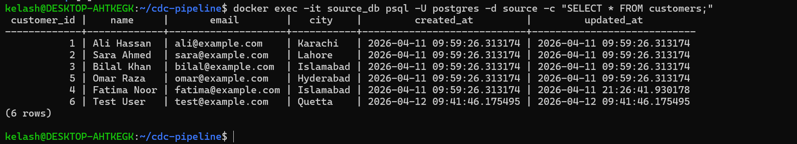
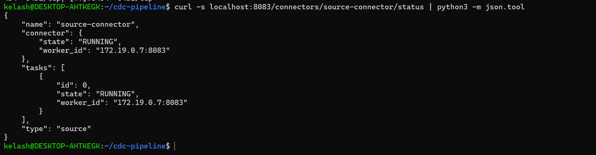
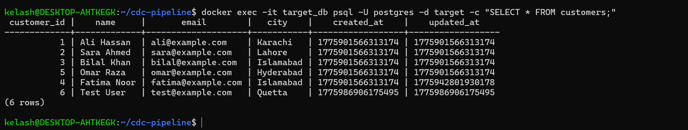
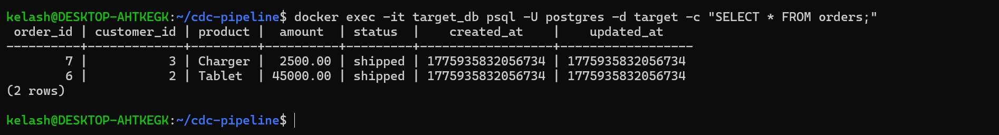
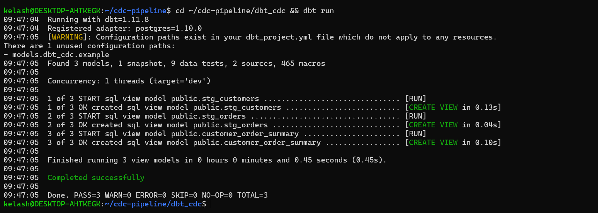
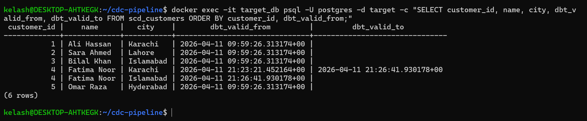
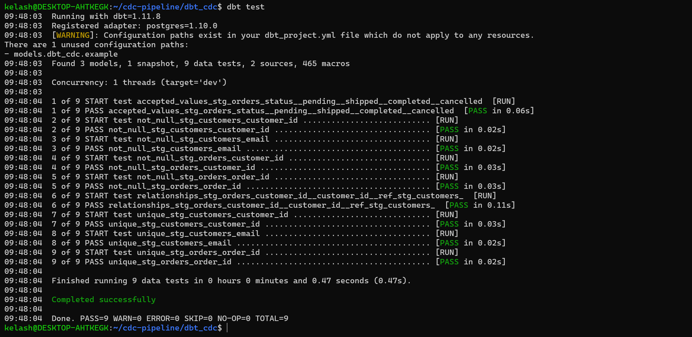
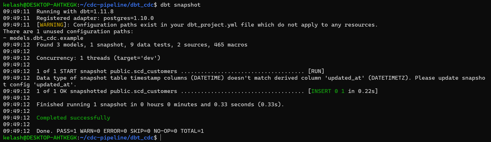
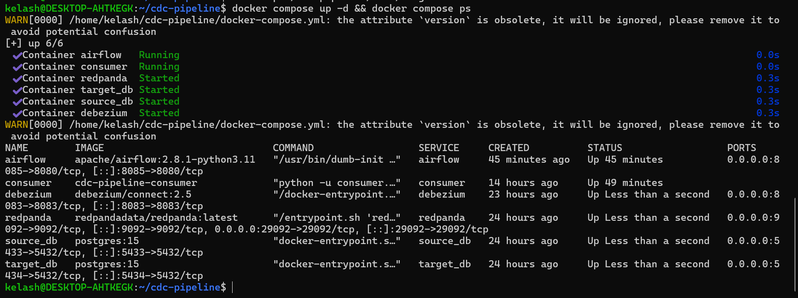

# CDC Pipeline

**Real-time Change Data Capture pipeline that replicates data from a source PostgreSQL database to a target database using Debezium, Redpanda, and a custom Python consumer — with SCD Type 2 historical tracking via dbt and pipeline monitoring via Airflow.**

> Built as part of an accelerated Data Engineering program · April 2026

---

## Architecture


The pipeline captures every INSERT, UPDATE, and DELETE from a source PostgreSQL database in real-time using Debezium's WAL-based Change Data Capture. Changes flow through Redpanda (a Kafka-compatible message broker) to a Python consumer that applies upsert logic to a separate target database. On top of the replicated data, dbt builds staging models, business-level marts, and SCD Type 2 snapshots that preserve the full history of dimension changes. An Airflow DAG orchestrates dbt runs and monitors CDC consumer lag every 30 minutes.

---

## Tech Stack

| Tool | Version | Role |
|------|---------|------|
| **PostgreSQL** | 15 | Source and target databases |
| **Debezium** | 2.5 | CDC connector — reads PostgreSQL WAL |
| **Redpanda** | Latest | Kafka-compatible message broker (zero JVM) |
| **Python** | 3.11 | Consumer service with upsert logic and dead letter queue |
| **dbt** | 1.11 | Data modeling — staging, marts, SCD Type 2 snapshots |
| **Airflow** | 2.8.1 | Orchestration and CDC lag monitoring |
| **Docker Compose** | — | Full containerized deployment (6 services) |

---

## How It Works

### 1. Source Database

The source PostgreSQL database runs with `wal_level=logical` enabled, which allows Debezium to read the Write-Ahead Log. The database contains two tables — `customers` and `orders` — seeded with initial data to simulate a production e-commerce system.



### 2. Debezium Captures Changes

Debezium connects to the source database's WAL using the `pgoutput` plugin. Every INSERT, UPDATE, and DELETE is captured as a structured JSON event and published to Redpanda topics (`cdc.public.customers` and `cdc.public.orders`). The connector runs continuously with zero impact on source database performance.



### 3. Python Consumer Replicates Data

A custom Python consumer reads CDC events from Redpanda and applies them to the target database using **upsert logic** (`INSERT ... ON CONFLICT DO UPDATE`). This makes the consumer **idempotent** — replaying the same event twice produces the same result. Events that fail processing are routed to a **dead letter queue** (file-based log) instead of crashing the pipeline.

The consumer handles Debezium's base64-encoded DECIMAL fields (a common gotcha that trips up most CDC implementations) by decoding them before insertion.

### 4. Target Database Receives Replicated Data

The target PostgreSQL is a completely separate database instance. After the consumer processes CDC events, the target contains an exact replica of the source data — verified below.

**Replicated customers:**



**Replicated orders:**



### 5. dbt Transforms Replicated Data

dbt runs three model layers on top of the replicated data in the target database:

**Staging layer** — clean views over the raw replicated tables (`stg_customers`, `stg_orders`) that serve as a single source of truth for downstream models.

**Marts layer** — `customer_order_summary` aggregates total orders, total spend, and last order timestamp per customer, answering business questions directly.

**SCD Type 2 snapshots** — `scd_customers` tracks the complete history of every customer dimension change using `dbt_valid_from` and `dbt_valid_to` timestamps. When a customer's city changes, the old record is closed and a new version is created — enabling time-travel queries like "where was this customer located last month?"



### 6. SCD Type 2 in Action

Below, customer Fatima Noor moved from Karachi to Islamabad. The snapshot preserves both versions — the Karachi record has a `dbt_valid_to` timestamp (closed), while the Islamabad record has `NULL` (active/current).



### 7. dbt Tests Validate Data Quality

9 data quality tests run on every dbt execution — uniqueness, not-null, referential integrity between orders and customers, and accepted values for order status. All 9 pass.



### 8. dbt Snapshots

The SCD Type 2 snapshot captures new versions of changed records on each run.



### 9. Airflow Orchestrates the Pipeline

The `cdc_pipeline_monitor` DAG runs every 30 minutes with three tasks in sequence: `check_cdc_lag` → `run_dbt_snapshot` → `run_dbt_test`. If CDC consumer lag exceeds 100 messages, the DAG raises an alert. This ensures the pipeline stays healthy and dbt models stay current with the latest replicated data.

---

## Quick Start

```bash
# Clone the repository
git clone https://github.com/kelashkumar-iba/cdc-pipeline.git
cd cdc-pipeline

# Start all 6 services
docker compose up -d
```



```bash
# Register the Debezium CDC connector
curl -X POST http://localhost:8083/connectors \
  -H "Content-Type: application/json" \
  -d '{
    "name": "source-connector",
    "config": {
      "connector.class": "io.debezium.connector.postgresql.PostgresConnector",
      "database.hostname": "source_db",
      "database.port": "5432",
      "database.user": "postgres",
      "database.password": "postgres",
      "database.dbname": "source",
      "topic.prefix": "cdc",
      "table.include.list": "public.customers,public.orders",
      "plugin.name": "pgoutput",
      "slot.name": "debezium_slot",
      "publication.name": "dbz_publication"
    }
  }'

# Verify data is replicating
docker exec -it target_db psql -U postgres -d target -c "SELECT * FROM customers;"
```

---

## CDC Operations

| Source Event | Debezium `op` | Consumer Action | Idempotent? |
|-------------|---------------|-----------------|-------------|
| INSERT | `c` (create) | `INSERT ... ON CONFLICT DO UPDATE` | Yes |
| UPDATE | `u` (update) | `INSERT ... ON CONFLICT DO UPDATE` | Yes |
| DELETE | `d` (delete) | `DELETE FROM ... WHERE pk = ?` | Yes |
| Initial snapshot | `r` (read) | `INSERT ... ON CONFLICT DO UPDATE` | Yes |

Every operation is idempotent — replaying CDC events produces identical results without data corruption.

---

## dbt Models

```
target database
├── staging/
│   ├── stg_customers          (view — clean customer records)
│   └── stg_orders             (view — clean order records)
├── marts/
│   └── customer_order_summary (view — aggregated business metrics)
└── snapshots/
    └── scd_customers          (table — SCD Type 2 historical tracking)
```

**9 data quality tests:** `unique`, `not_null`, `accepted_values`, `relationships` across all staging models.

---

## Key Engineering Decisions

**Two separate PostgreSQL instances** — In production, CDC replicates between distinct systems. Using a single database as both source and target would fake the core architecture. Two instances makes this project realistic and interview-defensible.

**Upsert logic with ON CONFLICT** — The consumer uses PostgreSQL's `INSERT ... ON CONFLICT DO UPDATE` for all write operations. This ensures idempotency — if the consumer crashes and restarts, replaying events from Redpanda won't create duplicates or corrupt data.

**Dead letter queue** — Failed CDC events are written to a log file instead of crashing the consumer. In production, this would route to a separate topic or alerting system. The pipeline continues processing healthy events while problematic ones are preserved for investigation.

**WAL-level logical** — PostgreSQL's Write-Ahead Log must be set to `logical` replication level for Debezium to read change events. This is a single configuration flag (`wal_level=logical`) but without it, CDC is impossible.

**Redpanda over Apache Kafka** — Same Kafka protocol, zero JVM overhead. Simpler to run locally, lower resource consumption, identical API compatibility. In production, either works — the consumer code doesn't change.

**dbt snapshots for SCD Type 2** — Rather than implementing slowly changing dimension logic manually in SQL, dbt's built-in snapshot strategy handles versioning, valid_from/valid_to timestamps, and hard delete invalidation automatically.

**Base64 decimal decoding** — Debezium encodes PostgreSQL `DECIMAL` fields as base64 strings, not plain numbers. The consumer includes a decoder that converts these back to numeric values before insertion — a real-world gotcha that most tutorials skip.

---

## Project Structure

```
cdc-pipeline/
├── docker-compose.yml           # 6-service orchestration
├── Makefile                     # Common commands
├── README.md
├── .gitignore
├── source_db/
│   └── init.sql                 # Source tables + seed data
├── consumer/
│   ├── Dockerfile               # Python 3.11 slim
│   ├── requirements.txt         # confluent-kafka, psycopg2
│   └── consumer.py              # CDC consumer with upsert + DLQ
├── dbt_cdc/
│   ├── dbt_project.yml
│   ├── models/
│   │   ├── staging/
│   │   │   ├── sources.yml
│   │   │   ├── schema.yml       # 9 data quality tests
│   │   │   ├── stg_customers.sql
│   │   │   └── stg_orders.sql
│   │   └── marts/
│   │       └── customer_order_summary.sql
│   └── snapshots/
│       └── scd_customers.sql    # SCD Type 2
├── airflow/
│   └── dags/
│       └── cdc_monitor_dag.py   # Lag monitoring + dbt orchestration
└── docs/
    └── images/                  # Architecture + pipeline screenshots
```

---

## Services & Ports

| Service | Container | Port | Purpose |
|---------|-----------|------|---------|
| Source PostgreSQL | `source_db` | 5433 | Production database (CDC source) |
| Target PostgreSQL | `target_db` | 5434 | Replicated database (CDC target) |
| Redpanda | `redpanda` | 9092 | Kafka-compatible message broker |
| Debezium | `debezium` | 8083 | CDC connector (Kafka Connect) |
| Python Consumer | `consumer` | — | Stream processor |
| Airflow | `airflow` | 8085 | DAG orchestration & monitoring |

---

## What I Learned

- **WAL-based CDC** captures changes from the database's internal transaction log with zero performance impact on the source — no polling, no timestamps, no triggers needed.
- **Debezium's decimal encoding** is a real production gotcha: `DECIMAL` columns arrive as base64 strings, not numbers. You must decode them in your consumer or every numeric insert will fail.
- **SCD Type 2** preserves the complete history of dimension changes — you can answer "what was this customer's city on March 15th?" which a simple overwrite-on-update approach destroys.
- **Dead letter queues** are essential in streaming pipelines: one malformed event should not crash the entire consumer and halt replication.
- **Upsert patterns** (`ON CONFLICT`) make CDC consumers replay-safe — the same event processed twice produces identical results, which is critical when Kafka consumer offsets reset.
- **Separate source and target databases** force you to think about the real production topology: network boundaries, connection pooling, schema drift between systems.

---

## Author

**Kelash Kumar** · BS Computer Science · Sukkur IBA University · Class of 2026

Built as Module 2 of the [Data Engineering Accelerated Mastery](https://github.com/kelashkumar-iba) program.

---
